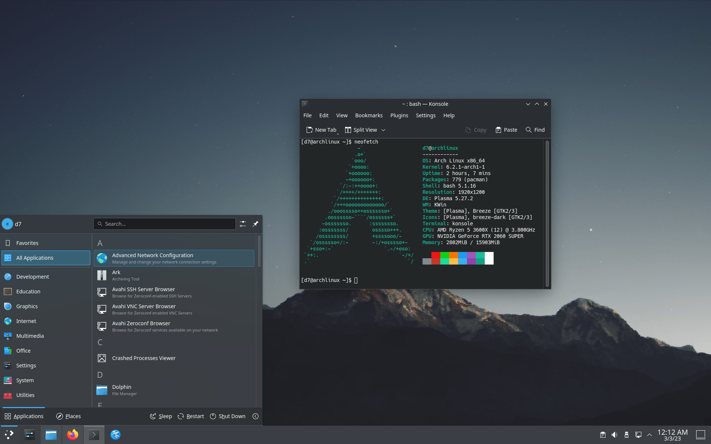
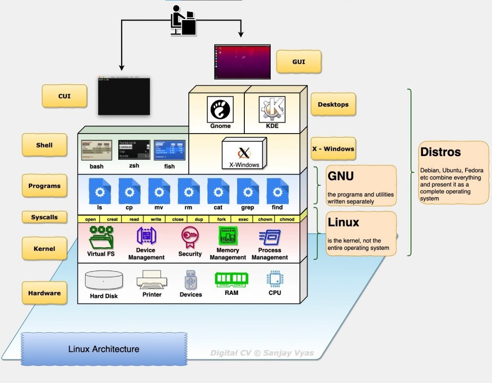

***ArkSys*** is a **Sys**tem based on **Ar**ch Linux with **K** Desktop Environment (KDE).

## Why to choose this system?
After installing multiple Linux distros with different desktop environments and  window managers, I always end up with a similar configuration and visual design. So this is the type of OS that I recommend to use in a daily drive for most computers.

## [Kernel = Linux](https://kernel.org/)
I have chosen Linux as the Operating System beacause is the biggest open-source project, is private, secure, very customazible and there is a big community that can help you . Also is the only one that can compite against the proprietary system such as Windows and macOS. And in case you don't know, Linux is only the Kernel of the Operating System that communicates with the computer hardware, the rest of the OS is constrcuted on top of that.

## Linux distribution = [Arch-Linux](https://archlinux.org/)
Arch Linux is a very lightway Linux distribution with around 300 packages preinstalled and with 800 MiB of space (perfect for old CDs). It has a big community that grows every day and it has a package manager (pacman) very useful with tons of packages from [arch](https://archlinux.org/packages/) and [AUR](https://aur.archlinux.org/). There are others distributions like Debian, Fedora, openSUSE, Slackware, Red hat, Alpine Linux, Void Linux... But Arch is simple focusing on learning and very customasible that features the last packages with its model rolling-release.

## Desktop Environment = [KDE](https://kde.org/)
Most of us are familiar with Windows or perhaps MacOS before using Linux, and these operating systems are great in terms of usability, but not for privacy.To achieve a similar design and good usability, the best option is to use a desktop environment such as KDE (K Desktop Environment) or, for something simpler, GNOME or XFCE. KDE is under development and is the biggest open-source project that develop free user applications. Also it has mouse gestures on laptops and is customizable to the exteme.

<!--
**Here are some ideas to get you started:**

🙋‍♀️ A short introduction - what is your organization all about?
🌈 Contribution guidelines - how can the community get involved?
👩‍💻 Useful resources - where can the community find your docs? Is there anything else the community should know?
🍿 Fun facts - what does your team eat for breakfast?
🧙 Remember, you can do mighty things with the power of [Markdown](https://docs.github.com/github/writing-on-github/getting-started-with-writing-and-formatting-on-github/basic-writing-and-formatting-syntax)
-->
